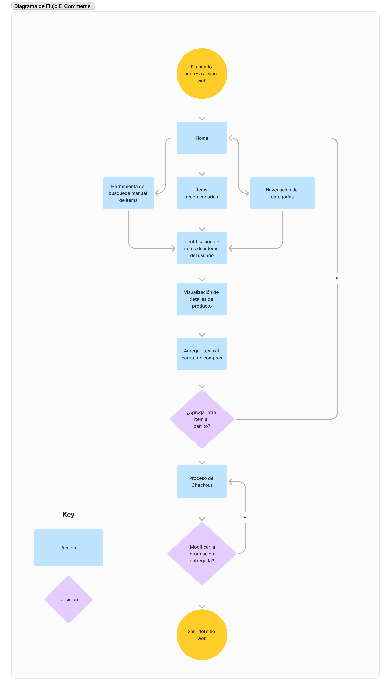

# PROYECTO MÓDULO 4: E-COMMERCE

Para el cuarto Proyecto Proyecto Integrador (PI) del Bootcamp de Henry, especialidad Frontend, se requiere crear una app de e-commerce para la venta de productos electrónicos. El sitio consistirá en una web donde usuarios -registrados o invitados- podrán realizar la compra de los productos ofrecidos. Aquellos usuarios registrados, además de poder guardar sus datos para futuras compras, recibirán una serie de beneficios, como ofertas especiales, acumulación de puntos y un servicio de atención al cliente preferencial. Además, tanto para usuarios registrados como para usuarios invitados, existirá un stock de ofertas, que será actualizado cada semana.

Cuando el usuario registrado cree su cuenta, cuando compre un producto y cuando existan ofertas y beneficios disponibles para registrados, éste recibirá un correo en su casilla de e-mail, según corresponda. Además, podrá subir una foto de perfil que lo identifique.

## UX/UI

- Barra de navegación
    - Logo de la Marca
    - Categorías de los productos
    - Herramienta de Búsqueda
    - Carrito de Compras

- Home
    - Carrusel: Ofertas del mes
    - Categorías populares
    - Carrusel: Items destacados
    - Reviews y premios destacados de la tienda

- Resultado de la búsqueda
    - Para aquellos usuarios que no quieren revisar todas las categorías, opción de buscar por palabra clave, resultados desplegados en una página que muestre las tarjetas de los productos que coincidan con la búsqueda

- Categoría de Productos
    - Carrusel con productos destacados de la categoría
    - Tarjetas de Producto
    - Opciones para filtrar contenido según marca, rango de precios, rating de los usuarios

- Producto
    - Información del producto seleccionado
    - Botón de añadir al carrito

- Carrito de Compras
    - Tarjetas de items seleccionados
    - Botón de continuar con la compra
    - Botón de agregar otro ítem a la compra (redirige al Home)
    - Ingreso de Códigos de Promo
    - Total de la Compra

- Página de Efectuar Compra
    - Formulario de datos de contacto
    - Formulario de datos de despacho
    - Formulario de modo de pago
    - Validaciones en tiempo real
    - Infomación del valor total de la compra
    - Posibilidad de hacer signin y guardar los datos registrados
    - Posibilidad de hacer login (a través de pop-up) y utilizar datos registrados previamente
    - Habilitación de botón de submit solo al completar todos los campos obligatorios

- Confirmación de la Compra
    - Checkeo de productos a comprar
    - Checkeo de datos personales y de contacto
    - Checkeo de información de despacho
    - Checkeo de valor total de la compra (productos + despacho)
    - Botón de modificar carrito, datos de contacto y/o despacho (redirige a la página de efectuar compra)
    - Botón de confirmar pedido (redirige al Home)

- Footer
    - Contacto
    - Quiénes somos
    - Rastrea tu pedido
    - Links a RRSS (Instagram, Facebook, Pinterest, Twitter, YouTube)
    - Trabaja con Nosotros
    - Términos y Condiciones
    - Políticas de Devoluciones
    - Políticas de Privacidad
    - FAQ

## Diagrama de Flujo

